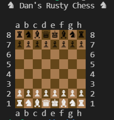

# Dan's Rusty Chess

Learning Rust and chessing.

## Features

- Incredible terminal interface
- Read from [FEN](https://en.wikipedia.org/wiki/Forsyth%E2%80%93Edwards_Notation)
- Start a game from a FEN
- Highlight available moves for a piece
- Loads of weird bugs

## Tech

- Rust
- tui (terminal ui)

## Playing

### Start with different boards

`cargo run -- --fen "rnbqkbnr/pppppppp/8/8/8/8/PPPPPPPP/RNBQKBNR w KQkq - 0 1"`

## Dev

### Building

`cargo build`

### Testing

`cargo test`

### Code coverage

`cargo tarpaulin`

## Resources

- https://www.chessprogramming.org/Main_Page
- https://github.com/SebLague/Chess-AI
- https://web.archive.org/web/20071026090003/http://www.brucemo.com/compchess/programming/index.htm
- https://www.adamberent.com/wp-content/uploads/2019/02/GuideToProgrammingChessEngine.pdf
